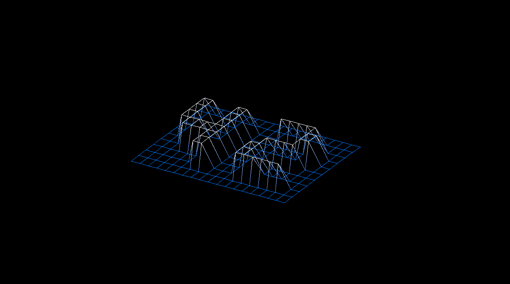
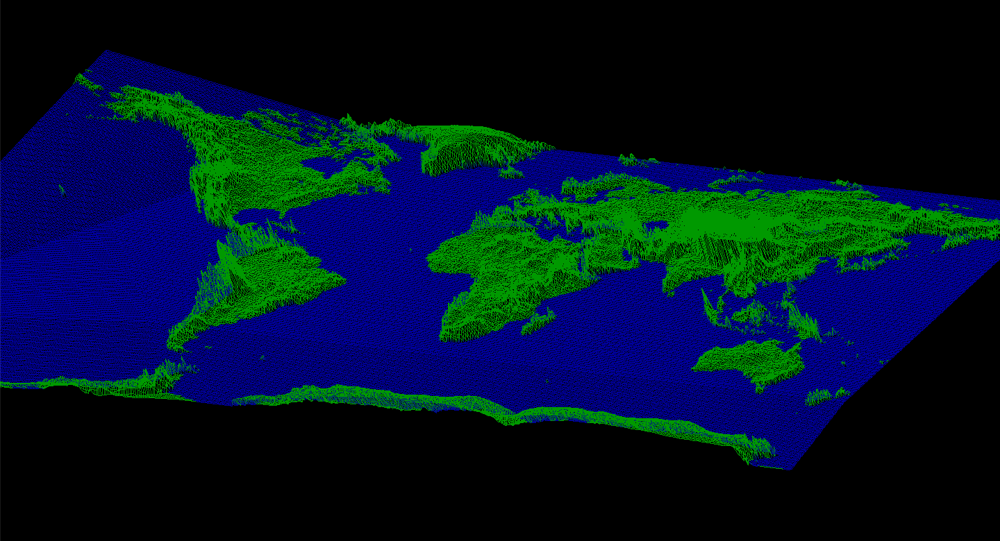
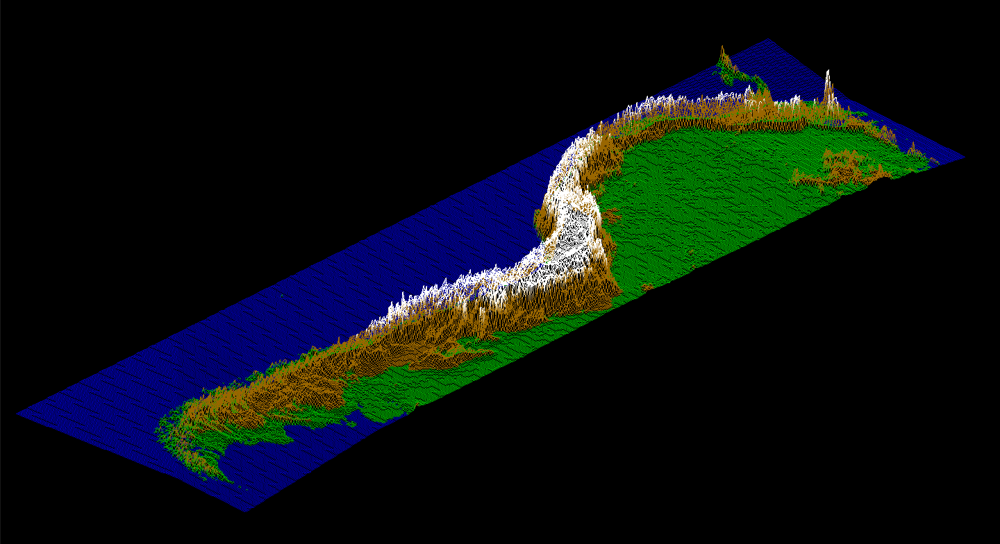
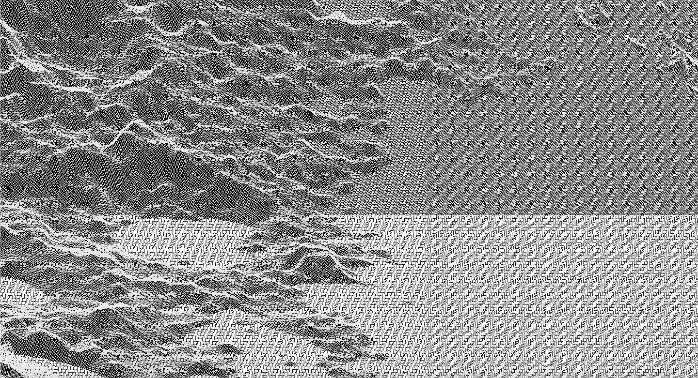
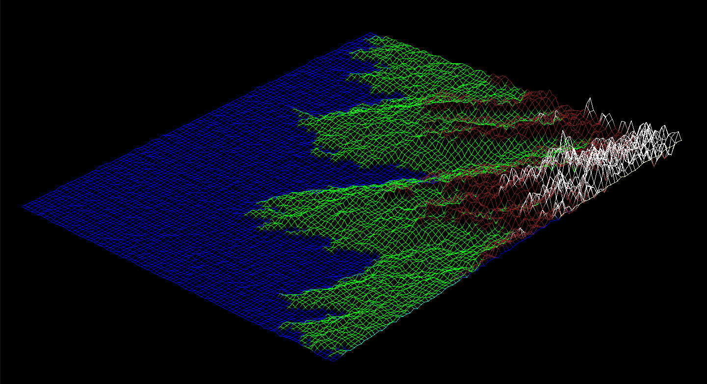

<h1 align="center">42cursus - FdF</h1>

<p align="center">
	
	
</p>

FdF is a project focused on representing a landscape as a 3D object using lines.

For more projects related to 42cursus, please visit the [hive-42cursus](https://github.com/wengcychan/hive-42cursus.git) repository.

## Introduction

This project involves creating a computer graphics application that generates a simple wireframe model of a landscape by connecting various line segments.



## Features

The FdF program supports the following controls:

| Control           | Action                  |
|-------------------|-------------------------|
| **Move**           |                         |
| `w`                 | Move Up                 |
| `a`                | Move Left               |
| `s`                 | Move Down               |
| `d`                 | Move Right              |
| **Rotate**         |                         |
| `x`                 | Rotate Along x-axis     |
| `y`                 | Rotate Along y-axis     |
| `z`                 | Rotate Along z-axis     |
| **Zoom**           |                         |
| `Mouse Scroll Up`   | Zoom Out                |
| `Mouse Scroll Down` | Zoom In                 |
| **Projection**     |                         |
| `i`                 | Switch to Isometric Projection |
| `o`                 | Switch to Oblique Projection |
| **Close Window**   |                         |
| `Esc`               | Close the Application   |

## Usage

To compile and use the FdF program, follow these steps:

1. Clone the repository to your local machine:

   ```bash
   git clone https://github.com/wengcychan/42cursus-fdf.git
	```

2. Compile the program:

   ```bash
	make
	```
&nbsp;&nbsp;&nbsp;&nbsp;&nbsp;&nbsp;&nbsp;&nbsp;&nbsp;&nbsp;&nbsp; This will generate an executable named `fdf`.

3. Execute your FdF program using a landscape file as a parameter:

   ```bash
	./fdf 42.fdf
	```
&nbsp;&nbsp;&nbsp;&nbsp;&nbsp;&nbsp;&nbsp;&nbsp;&nbsp;&nbsp;&nbsp; Replace `42.fdf` with the name of your landscape file.

## Showcase


<br> <br>

<br> <br>

<br> <br>


## Credits

Maps generated using [42MapGenerator](https://github.com/jgigault/42MapGenerator.git).
